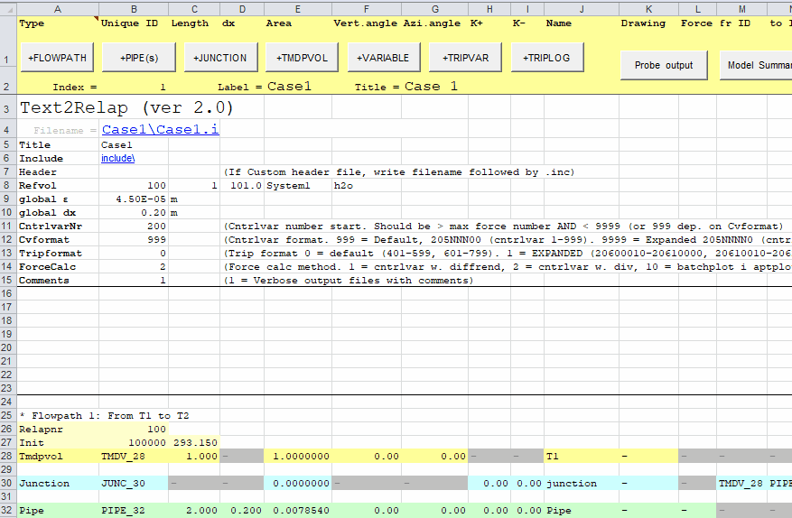

# Simple tanksystem 1

## Pipe layout

## Step 1: Add pipe geometry

## Step 2: Set timestep control

## Step 3: Generate input file and review output

## Step 4: Run calculation and look at result

