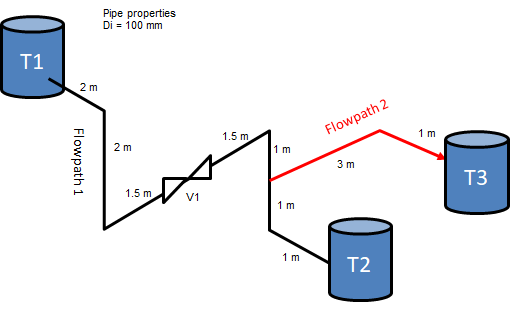
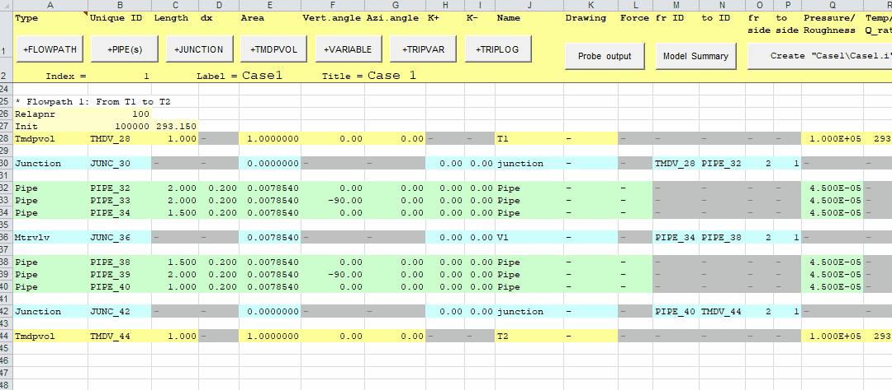
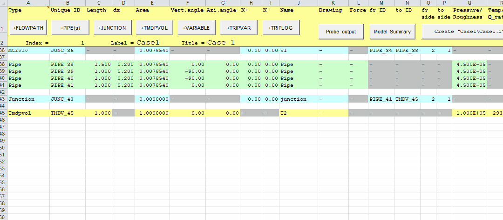
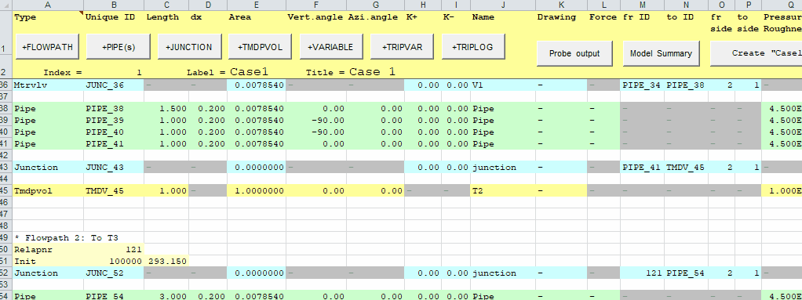

# Simple tanksystem 2 - multiple flowpaths / branches

## Pipe layout

## Step 0: Build on tanksystem 1

## Step 1: Split the last vertical pipe segment in flowpath 1 into two equal parts

## Step 2: Add the new flow path

## Step 3: Connect flowpath 2 to flowpath 1

