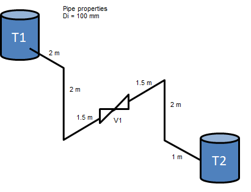
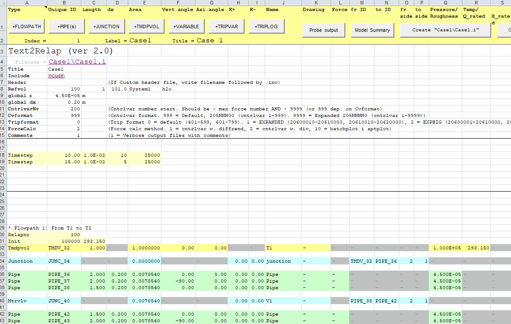
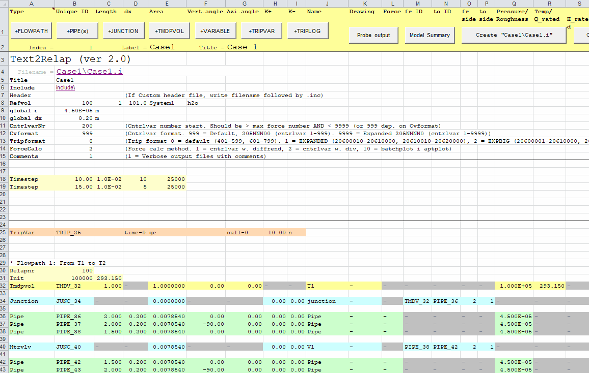
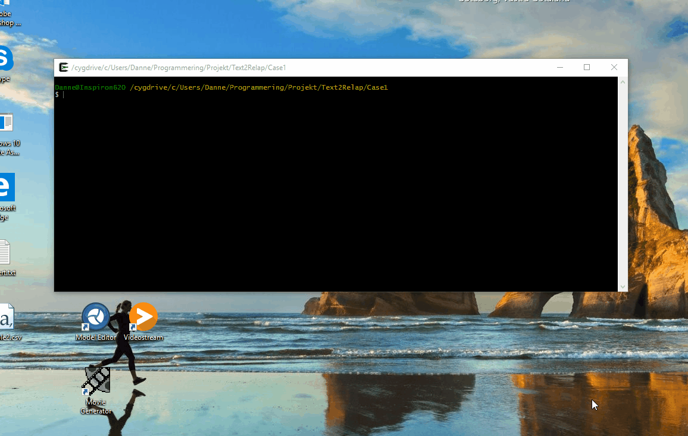

# Simple tanksystem 2 - multiple flowpaths / branches

## Pipe layout

## Step 0: Build on tanksystem 1

## Step 1: Create a new variable trip

The input for a variable trip that is true >= 15 seconds looks like this

`405  time  0   ge  null  0   10.00   n`

To include this trip one can either use the `Custom`-word and include it as a custom include file or it can be added directly like this:

## Step 2: Create a new include file for valve V1
In order to get the valve to close a valid close trip must be added to the motor valve component. This is achieved by adding **.inc** to the name of the valve. That triggers text2relap to add a so called *include file* from the specified include folder. If no file exists a generic one is created that can be altered.

## Step 3: Run calculation and look at result

