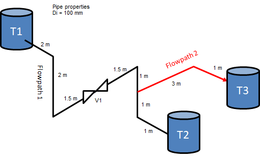

# Simple tanksystem 2 - multiple flowpaths / branches

## Pipe layout

## Step 0: Build on tanksystem 1

## Step 1: Create a new variable trip

The input for a variable trip that is true >= 15 seconds looks like this

`405  time  0   ge  null  0   15.00   n`

## Step 2: Create a new include file for valve V1

## Step 3: Generate input file and review output

## Step 4: Run calculation and look at result
